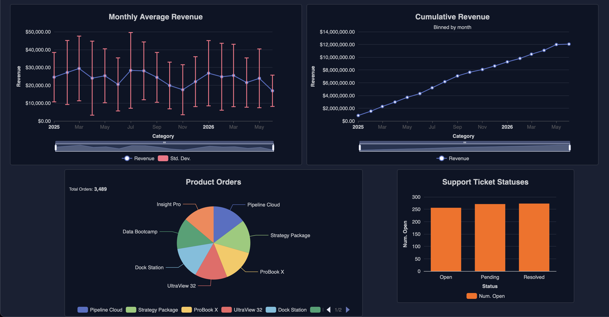
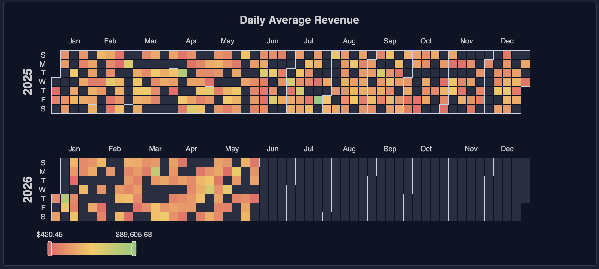

# Spyglass

[Download](https://github.com/exoRift/spyglass/releases)

Spyglass is a standalone database visualization dashboard for easy insights and analytics into business metrics.

## Usage
Think of Spyglass as a lightweight version of Microsoft PowerBI. You can construct dashboards of various charts powered by data from your database, offering a live preview to your data and informatics.

## Customizable Layout

## Line Graphs

## Bar Charts

## Pie Charts

## Heatmaps

## Advanced Data Controls

## Multiple Connections

## Supported Databases
Spyglass supports
- [PostgreSQL](https://www.postgresql.org/)
- [MySQL](https://www.mysql.com/)
- [SQLite](https://sqlite.org/)
- [OracleDB](https://www.oracle.com/database/)
- [Microsoft SQL Server](https://www.microsoft.com/en-us/sql-server)
- [CockroachDB](https://www.cockroachlabs.com/)
- [Amazon Redshift](https://aws.amazon.com/redshift/)
- [MariaDB](https://mariadb.org/)
